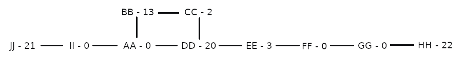
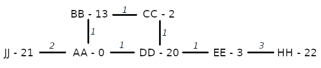
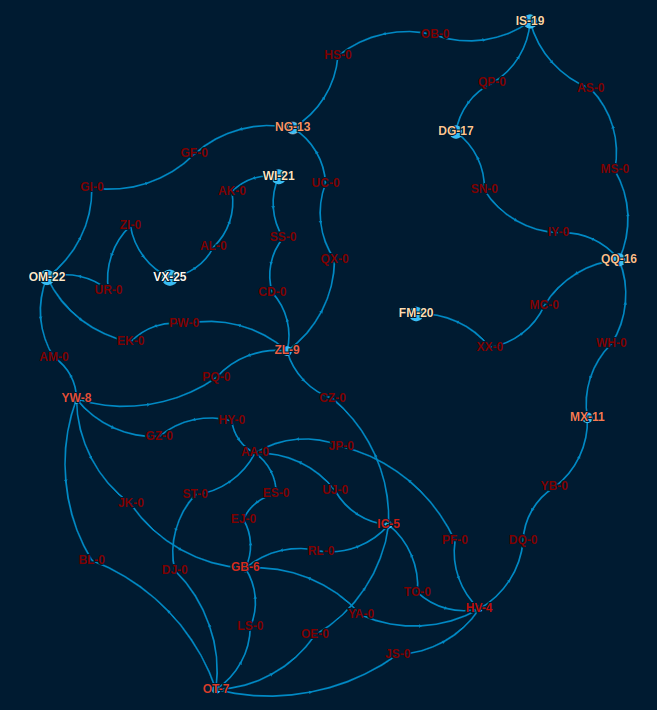
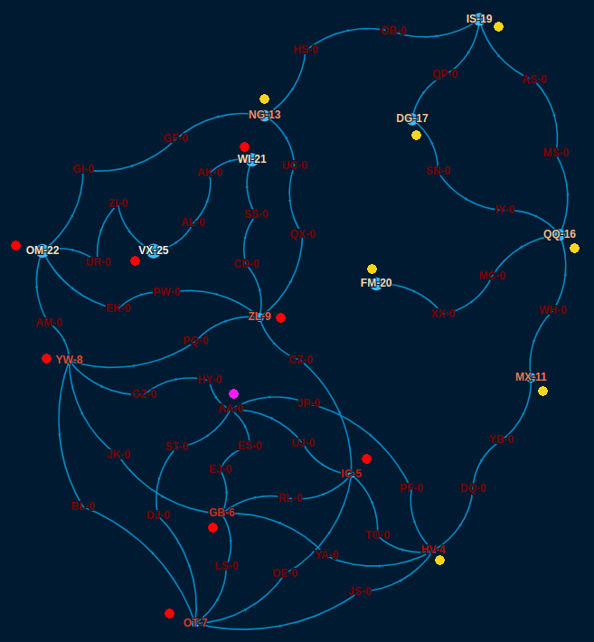

# Day 16: Proboscidea Volcanium

Description of the task for this day can be found in https://adventofcode.com/2022/day/16.

## Solution used

For this problem we are going to use A* algorithm to find the optimal path to follow. 

A* is pretty flexible since it allows you to define your optimality criteria. You need to define a heuristic to estimate, at each step, what is the remaining cost to complete the graph. Typically A* is used to minimize the cost of going over the whole graph. For the algorithm to find such minimum, the heuristic should never overestimate the remaining cost.

### Part 1

In our case we are trying to maximize the pressure release. Therefore, the heuristic should never underestimate the remaining pressure gain. The heuristic used here is: sum up the pressure you would release from all remaining valves if you could visit all of them in parallel. For instance, let's look at the example graph:

*Starting at `AA`, we have already opened valves `DD` and `BB` and we are standing at `BB` after 5 minutes. During the remaining 25 minutes we could release the following pressures if we went directly to each valve:*
- *`CC` - 1 minute to arrive & 1 minute to open it - It would release `(25-1-1)*2 = 46`*
- *`EE` - 3 minutes to arrive & 1 minute to open it - It would release `(25-3-1)*3 = 63`*
- *`HH` - 6 minutes to arrive & 1 minute to open it - It would release `(25-6-1)*22 = 418`*
- *`JJ` - 3 minutes to arrive & 1 minute to open it - It would release `(25-3-1)*21 = 441`*

*If we could go to all valves at the same time from our current position, they would release `46 + 63 + 418 + 441 = 968` pressure units.*

That is the best we can do to estimate the remaining pressure release without assuming any order for the valves opening. And that value is clearly always large than the actual release we would obtain.

Besides, in order to reduce the amount of choices for the algorithm, we will
- ignore valves with `0` pressure (except the starting point)
- and collapse edges between relevant valves by adding weight to the new edges.

With those simplifications, the example graph would look like:

 

### Part 2

We could modify the implementation of the algorithm to maintain the state both subjects on each iteration. However, that would require to implement a pretty complex pruning logic, to decide whether a path should be discarded based on what the other subject has done and is going to do.

To keep the approach simple and reduce the coding time, we went with an approach that, although less general, is more intuitive. The optimal solution would require to find an optimal split of the valves that should be open by each subject. For each split, we could use the same solution as for Part 1 (limiting the valves each one can visit) and sum the pressure released by each one.

Instead of trying to implement some graph splitting algorithm, that would require again a pretty complex optimization measure, we visualized the input graph. For that, we used the online version of [LynxKite](https://lynxkite.com/), an open-source graph data science platform. 

As expected, this graph is much more complex than the example, with more nodes and overlapping edges. Although we cannot decide on a perfect split for the nodes, we can at least identify some nodes that are very likely not going to be visited by the same subject. For instance, it is pretty safe to say that:
- The human is going to visit the main valves on the left, `OM`, `VX` and `WI`.
- The elephant is going to visit the main valves on the right, `MX`, `FM`, `QQ`, `DG` and `IS`.

For the remaining `7` valves there are `128` possible combinations. We can "brute-force" through those combinations to find the optimal split (human, elephant and starting point).

