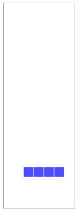

# Day 17: Pyroclastic Flow

Description of the task for this day can be found in https://adventofcode.com/2022/day/17.

## Solution used

This is basically a Tetris game. As when sparse matrices appeared on previous days, the positions of the pieces (i.e. rocks) are represented with a dictionary. A Rock class is created to handle the movement logic.

Although not necessary, instead of using the text representation of the matrix positions as in the problem description, I decided to allow storing the rock movements as an animated GIF. You can see below the simulated movement for the first 10 rocks, using the input jets.



<br>

*Note - In order to run the GIF storing, it is required to (temporarily) store Altair figures as PNG, which requires some [additional configuration steps](https://github.com/altair-viz/altair_saver#additional-requirements).*

<br>

### Part 2

The trick for the second part is to find a cycle in the rock falling pattern. The rocks will behave the same after the same
- rock type,
- position in the jet sequence
- and floor profile.

However, the cycle may not start right with the first rock. And the last rocks may not complete a full cycle either. So some extra logic is required after finding the cycle.

In order to mark the floor profile, we start a pointer on the highest left-most rock and move along the rock border using the following logic:
1. First try to turn to the right from the current position.
2. If it is not possible to turn right, try to continue straight on the same direction.
3. If also blocked, turn anticlockwise until a free path is found.

The path followed by the pointer is represented as a string with the direction taken at each step, `'>'`, `'v'`, `'<'` and `'^'`.
For instance, for the following example (where `'#'` represent rocks and `'.'` empty spaces) the string would be `'>^^>>vv>v>v>v>'`.

```
|.......|    |.......|
|.......|    |.>>v...|
|..#....|    |.^#v...|
|..#....|    |>^#>v..|
|####...|    |####>v.|
|..###..|    |..###>v|
|..####.|    |..####>|
+-------+    +-------+
```

To try to speed up the process even more, we checked whether the input jet string also had a cycle (using the logic proposed [here](https://www.geeksforgeeks.org/find-given-string-can-represented-substring-iterating-substring-n-times/)). But it didn't.
